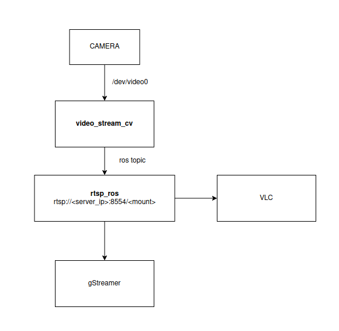

# ros-stream-stack 

ROS metapackage used to group available ROS packages for network streaming solutions. 

In order to properly use following metapackage it's neccessary to install `gstreamer` libs 
as follows: 
```
sudo apt-get install gstreamer1.0-plugins-ugly libgstreamer-plugins-base1.0-dev libgstreamer-plugins-good1.0-dev libgstreamer-plugins-bad1.0-dev libgstrtspserver-1.0-dev 
```

OpenCV is also prerequisite and you can try to install it with `python-pip` as follows: 
```
pip install opencv 
```

You can find detailed instructions how to install OpenCV [here](https://linuxize.com/post/how-to-install-opencv-on-ubuntu-18-04/) 

## Currently ros-stream-stack contains following ROS packages: 
 * [video-stream-opencv](http://wiki.ros.org/video_stream_opencv)  
 * [ros-rtsp](https://github.com/CircusMonkey/ros_rtsp)  


### Launching 

If you want to test your webcam (create ROS topic and stream data to it), you can run it as follows: 
```

roslaunch video_stream_opencv camera.launch

```
Webcameras are mostly `/dev/video0`. You can configure your cam by passing right calibration matrix. 
Change relative path in launch file and create config file as `test_calibration.yaml`.  
After that, if you want to create RTSP streaming server, you can run: 
```
roslaunch ros_rtsp rtsp_streams.lauch

```
You can configure what you stream with `stream_setup.yaml`. 

It's possible to stream directly from device such as `/dev/video/X` or from ROS topic. 

When streaming, address is: 
```
rtsp://<server_ip>:8554/<your_stream_mountpoint>
```

#### It's tested LAN with internet access with static IPs. 
#### Test over Wi-Fi needs to be done, to test latency and speed

Run stream on another PC with one of the following commands: 
```
gst-launch-1.0 -v rtspsrc location=rtsp://<server_ip>:8554/<your_stream_mountpoint> drop-on-latency=true use-pipeline-clock=true do-retransmission=false latency=0 protocols=GST_RTSP_LOWER_TRANS_UDP ! rtph264depay ! h264parse ! avdec_h264 ! autovideosink sync=true
```

```
vlc --no-audio --avcodec-hw=any --sout-rtp-proto=udp --network-caching=300 --sout-udp-caching=0 --clock-jitter=0 --rtp-max-misorder=0 rtsp://<server_ip>:8554/<your_stream_mountpoint> :udp-timeout=0
```

### Current arch for RTSP ROS stream 


 
## Packages to test and possibly add: 

 * [mjpeg-server](https://wiki.ros.org/mjpeg_server)  
 * [web-video-server](http://wiki.ros.org/web_video_server)  

## TODO
 
 - [ ] Create unifying launch wth correct cam and stream settings for demonstration purposes 
 - [ ] Test over WiFi
 - [ ] Latency check during test 
 - [ ] Integrate with existing danieli GUI

# Note: 
Metapackages don't work with 0.6.1 catkin tools which is current default `catkin-tools` version. 
Therefore, extract packages from metapackage for now. 


